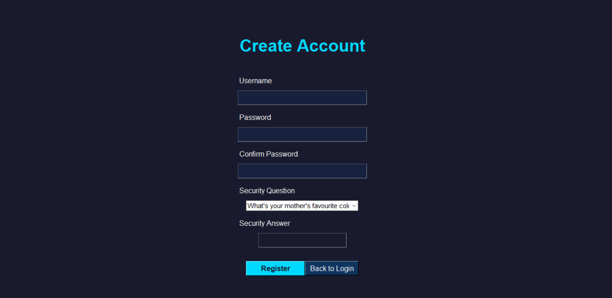
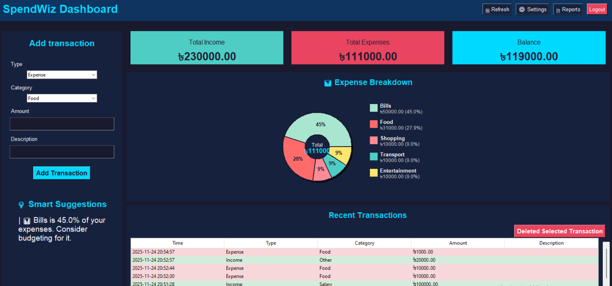
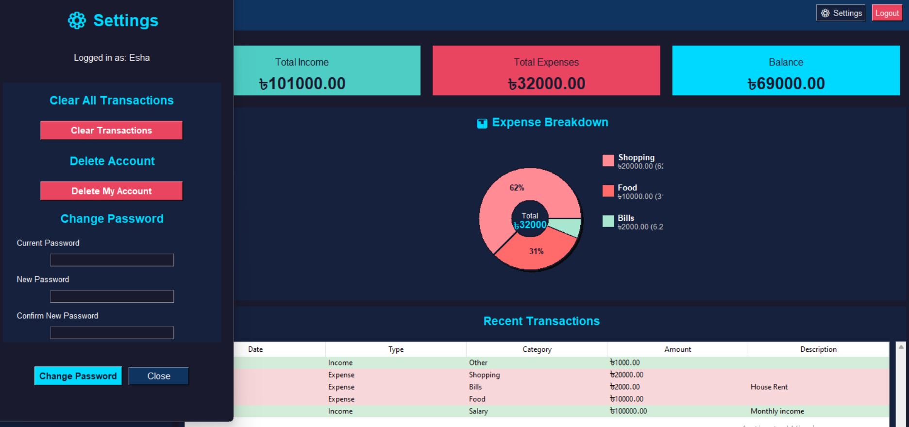

# SpendWiz
### *Your Personal Expense Companion*

SpendWiz is an intuitive and user-friendly expense tracker designed to help you manage your finances effortlessly. It tracks your income, expenses, and gives smart suggestions to make your budgeting easier. 


---


## Features

- **User Authentication:** Secure login and signup system for personalized tracking.
- **Add Transactions:** Easily record income and expenses with categories, descriptions and dates.
- **Smart Suggestions:** Get intelligent insights and suggestions to optimize your spending habits.
- **Visual Summary:** View your spending trends at a glance.
- **Delete Account Option:** Manage your account conveniently from the settings. 
- **Local Data Storage:** All your data is safely stored on your device using SQLite; no external server required.


---


## Technologies Used

- Python
- Tkinter (GUI)
- SQLite (Database)
- Hashlib (Password Security) 


---


## How to Run the Application
1. Ensure you have Python installed on your machine. You can download it from [python.org](https://www.python.org/).
2. Clone this repository to your local machine using:
3. ```bash
   git clone https://github.com/EshaHassan2005/SpendWiz.git
   ```
   
4. Navigate to the project directory:
    ```bash
    cd SpendWiz
    ```
5. Run the application:
    ```bash
    python main.py
    ```
6. Follow the on-screen instructions to sign up or log in and start tracking your expenses!
7. Enjoy managing your finances with SpendWiz!


---


## Screenshots

### Login and Register Page
<div align="center">
    
    
</div>

### Dashboard and Settings Page
<div align="center">
    
    
</div>


---


Created with ❤️ by **Sanjana Hassan Esha**